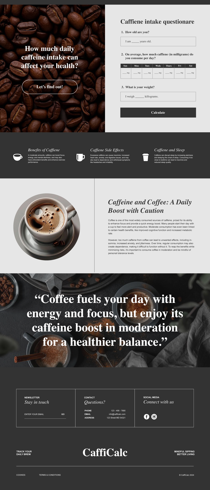

# Name CaffiCalc

<<<<<<< HEAD
This application is named CaffiCalc indication that it help users to calculate caffeine intake and also tracks weekly intakes.

## Description

Caffeine can have many health effects, including:
Insomnia
Caffeine can make it difficult to sleep, especially if consumed in the afternoon. Over time, caffeine can become a crutch that loses its ability to wake you up.
Anxiety
Caffeine can trigger the body's fight-or-flight response, which can lead to feelings of anxiety and nervousness.
Headaches
While moderate doses of caffeine can help relieve headaches, excessive consumption can cause headaches and migraines.
Dehydration
Caffeine acts as a diuretic, which increases urine production and can lead to dehydration.
Digestive issues
Caffeine can stimulate bowel movements, but drinking too much coffee in a day can cause digestive issues.
Heart and blood pressure
Caffeine can have an adverse effect on the heart and blood pressure.
Overdosing
Overdosing on caffeine can cause vomiting, palpitations, high blood pressure, and in severe cases, seizures and death.

## Visual

=======
This application is named CaffiCalc which enables users to  personally track and set personal caffeine limits based on health guidelines or your own preferences, and receive tailored recommendations to stay within safe consumption levels.

## Description

Caffeine Calculator is an intuitive app that simplifies tracking and optimizing your daily caffeine intake. With a user-friendly interface, it allows you to input details about your age, weight and daily coffee intake and calculates and return answers if your intake is healthy, moderate and excessive amount.

## Visual

>>>>>>> 69a2e1919e15f20c3d56b51feacd865e1e639499

## Usage

Input in the modal how old you are, weekly intake of caffeine in milligrams and body weigh to get a results of:
Healthy Amount
Up to 200 mg/day is considered safe for most adults, according to health authorities like the FDA. This is roughly the equivalent of 4 cups of brewed coffee.
Moderate Amount
300–400 mg/day is considered a moderate amount. This is about 2–4 cups of coffee and is generally safe for most people without significant side effects.
Excessive Amount
400+ mg/day is generally considered excessive. This may lead to side effects like restlessness, insomnia, headaches, dizziness, fast heartbeat, and anxiety.

## Support

Tell people where they can go to for help in listed email below.

## Authors and acknowledgment
<<<<<<< HEAD

The contributors to this project is Helona Mekuria, Aldo Herrera and Trish Ho.
=======
The contributors to this project is Helona Mekuria, Aldo Herrera and Trish Ho.
>>>>>>> 69a2e1919e15f20c3d56b51feacd865e1e639499
